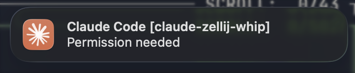

# claude-zellij-whip

Smart macOS notifications for [Claude Code](https://docs.anthropic.com/en/docs/claude-code) running in [Ghostty](https://ghostty.org/) + [Zellij](https://zellij.dev/). When you click a notification, it focuses Ghostty, navigates to the correct Zellij tab, and focuses the exact pane where Claude Code is waiting.



## The Problem

Claude Code's default `\a` bell notifications don't work properly through Zellij. Even with workarounds like `terminal-notifier`, clicking notifications doesn't bring you back to the right place.

## The Solution

A headless macOS app that:

1. Sends notifications via `UNUserNotificationCenter`
2. Captures Zellij context (session, tab, pane) when sending
3. On click: focuses Ghostty → navigates to tab → focuses pane

## Dependencies

- **macOS** (uses `UNUserNotificationCenter`)
- **[Ghostty](https://ghostty.org/)** terminal
- **[Zellij](https://zellij.dev/)** terminal multiplexer
- **[room](https://github.com/rvcas/room)** - Zellij plugin that handles pane focusing via pipe

## Installation

### 1. Install the room plugin

```bash
# Clone and build
git clone https://github.com/rvcas/room
cd room
cargo build --release

# Copy to Zellij plugins
mkdir -p ~/.config/zellij/plugins
cp target/wasm32-wasip1/release/room.wasm ~/.config/zellij/plugins/
```

Make sure room is loaded in your Zellij session (via layout or config).

### 2. Build and install ClaudeZellijWhip

```bash
git clone https://github.com/rvcas/claude-zellij-whip
cd claude-zellij-whip
make install
```

The app will be installed to `~/Applications/ClaudeZellijWhip.app`.

#### Code Signing (Optional)

By default, the app is ad-hoc signed. To sign with your Apple Developer ID:

```bash
# Find your identity
security find-identity -v -p codesigning

# Set it in the Makefile or pass it directly
make install SIGNING_IDENTITY="Apple Development: Your Name (XXXXXXXXXX)"
```

## Usage

### Manual test

```bash
open ~/Applications/ClaudeZellijWhip.app --args notify \
  --title "Claude Code" \
  --message "Test notification" \
  --folder "my-project"
```

### Claude Code hooks

Add to `~/.claude/settings.json` (see [hooks documentation](https://docs.anthropic.com/en/docs/claude-code/hooks)):

```json
{
  "hooks": {
    "Notification": [
      {
        "matcher": "idle_prompt",
        "hooks": [{
          "type": "command",
          "command": "open ~/Applications/ClaudeZellijWhip.app --args notify --title 'Claude Code' --message 'Waiting for your input' --folder ${CLAUDE_PROJECT_DIR##*/}"
        }]
      },
      {
        "matcher": "permission_prompt",
        "hooks": [{
          "type": "command",
          "command": "open ~/Applications/ClaudeZellijWhip.app --args notify --title 'Claude Code' --message 'Permission needed' --folder ${CLAUDE_PROJECT_DIR##*/}"
        }]
      }
    ]
  }
}
```

The `--folder` parameter appends the project folder name to the notification title (e.g., "Claude Code [my-project]"), using the `CLAUDE_PROJECT_DIR` environment variable provided by Claude Code.

## How It Works

```
Claude Code Hook
    ↓
open ClaudeZellijWhip.app --args notify --message "..."
    ↓
App captures: $ZELLIJ_SESSION_NAME, $ZELLIJ_PANE_ID, current tab name
    ↓
Shows macOS notification (with context in userInfo)
    ↓
User clicks notification
    ↓
App activates Ghostty
    ↓
App runs: zellij --session <session> action go-to-tab-name <tab>
    ↓
App runs: zellij --session <session> pipe --plugin file:~/.config/zellij/plugins/room.wasm --name focus-pane -- <pane_id>
    ↓
room plugin calls focus_terminal_pane(pane_id)
```

## Project Structure

```
claude-zellij-whip/
├── Sources/
│   ├── main.swift              # Entry point, mode detection
│   ├── AppDelegate.swift       # Notification click handling
│   ├── NotificationSender.swift # Notification creation
│   ├── FocusManager.swift      # Ghostty/Zellij focus logic
│   └── ZellijContext.swift     # Tab name extraction
├── Resources/
│   ├── Info.plist              # App bundle config (LSUIElement)
│   └── AppIcon.icns            # App icon (shows in notifications)
├── Package.swift
└── Makefile
```

## Makefile Targets

- `make build` - Debug build
- `make release` - Release build
- `make install` - Build, bundle, sign, and install to ~/Applications
- `make uninstall` - Remove the app
- `make clean` - Clean build artifacts
- `make list-identities` - Show available code signing identities

## License

MIT
